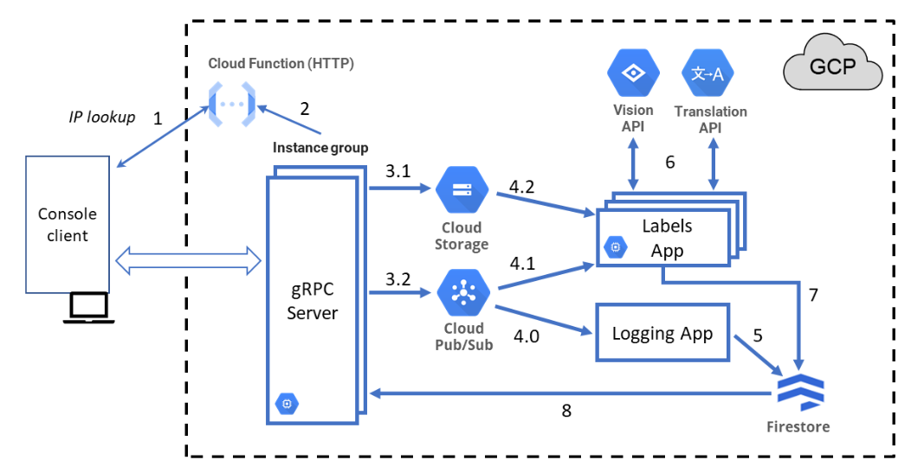

# CNV2024TF - Cloud-Based Image Label Detection and Translation System

## Overview

CNV2024TF is a cloud-based system designed to detect labels (e.g., tree, street, night, cat, fish) in image files (JPG, PNG, etc.) and translate these labels from English to Portuguese. The system leverages various Google Cloud Platform (GCP) services to achieve elasticity, enabling dynamic scaling of image processing capabilities.

## Objectives

- Develop a system for submitting and executing computational tasks in the cloud with elastic scalability.
- Integrate GCP services for storage, communication, and computation, including Cloud Storage, Firestore, Pub/Sub, Compute Engine, and Cloud Functions.

## Architecture

The system architecture, as shown in Figure 1, consists of several key components:

### Components and Interactions

1. **ClientApp**: The user interface for submitting image files and retrieving results, as well as scaling the number of instances for the server and the image processing units.
2. **CloudFunction (HTTP)**: Performs IP lookup for gRPC server instances.
3. **ServerApp**: Facilitates communication between the client and backend services, supporting both functional operations (SF) and system elasticity management (SG).
4. **Cloud Storage**: Stores submitted image files.
5. **Firestore**: Stores metadata about image processing requests and results.
6. **Pub/Sub**: Enables decoupled message exchange between gRPC servers and image processing applications.
7. **Compute Engine**: Hosts virtual machines and instance groups for running gRPC servers and image processing applications.
8. **Labels App**: Processes images to detect labels and translates them.
9. **Logging App**: Logs processing requests and results.

## Functional Operations (SF)

- **Submit Image File**: Streams image content, byte by byte, to Cloud Storage and returns a unique request identifier.
- **Retrieve Labels and Translations**: Using the request identifier, retrieves detected labels, translations, and the processing date.
- **Query Images by Label and Dates**: Retrieves filenames of stored images containing a specified label within a date range.

## Elasticity Management Operations (SG)

- **Scale gRPC Server Instances**: Increases or decreases the number of gRPC server instances based on demand.
- **Scale Image Processing Instances**: Adjusts the number of instances processing image files.

## Operation Flow

1. **IP Lookup**: The client performs an IP lookup to get gRPC server addresses via a Cloud Function.
2. **Image Submission**: After choosing the ip, the client submits an image, which is stored in Cloud Storage. A message is sent to a Pub/Sub topic, "GRPCServerMessages", with the image details.
3. **Logging**: The Logging App subscribes to the Pub/Sub topic, with the LoggingAppSub subscription, and logs the request in Firestore.
4. **Image Processing**: The Labels App, subscribed to the same topic, with LabelsAppSub subscription, processes the image using the Vision API and translates labels using the Translation API.
5. **Store Results**: The processing results are stored in Firestore with the db-name database.
6. **Query Results**: The client can then query the gRPC server for processing results, which retrieves the information directly from Firestore.

## Setup and Deployment

### Prerequisites

- Google Cloud Platform account
- gRPC client setup
- Google Cloud SDK

### Deployment Steps

1. **Create GCP Resources**: Set up Cloud Storage, Firestore, Pub/Sub, Compute Engine, and Cloud Functions.
2. **Deploy gRPC Servers**: Deploy gRPC server instances in an instance group on Compute Engine.
3. **Deploy Cloud Functions**: Implement and deploy the IP lookup Cloud Function.
4. **Deploy Applications**: Deploy the Labels App and Logging App to handle image processing and logging.
5. **Configure Pub/Sub**: Set up Pub/Sub topics and subscriptions for communication between components.

### Running the System

1. **Client Initialization**: Initialize the console client to interact with the gRPC server.
2. **Submit Image**: Use the client to submit an image file for processing.
3. **Query Results**: Retrieve processing results using the request identifier.
